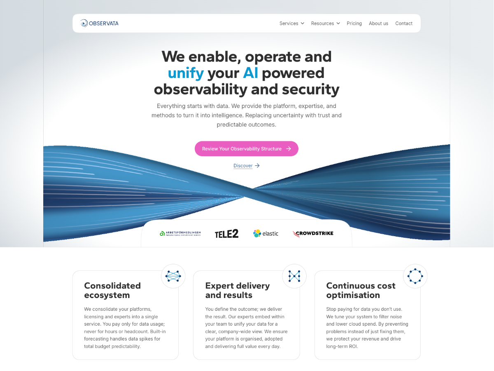

# Observata

[](https://github.com/gotpop/observata/actions/workflows/lint.yml)
[](https://github.com/gotpop/observata/actions/workflows/test.yml)
[](https://github.com/gotpop/observata/actions/workflows/phpstan.yml)

Custom WordPress theme using Gutenberg blocks with Timber/Twig server-side rendering.



## Stack

- **Timber 2.x** — Twig templating for PHP
- **Twig 3.x** — template engine for all block + page rendering
- **@wordpress/scripts** — block build tooling (webpack)
- **Three.js + Shaders** — WebGPU/WebGL hero shader effects

<details><summary>Architecture</summary>

All blocks are **server-rendered via Twig** (not PHP `render.php`). The render pipeline:

```
WP block editor (React/JSX edit components)
        ↓ saved as block markup in post_content
WordPress do_blocks() → observata_render_block_twig()
        ↓ merges Timber::context() + block attributes
Twig template (.twig) → server-rendered HTML
```

### Block Types

| Prefix     | Purpose                            | Example                            |
| ---------- | ---------------------------------- | ---------------------------------- |
| `section-` | Full-page sections                 | `section-hero-home`, `section-cta` |
| `card-`    | Reusable content cards             | `card-simple`, `card-geo`          |
| `grid-`    | Layout grids wrapping child blocks | `grid-cards-simple`                |
| `element-` | Small text/layout elements         | `element-body-md`                  |

Each block directory contains:

```
blocks/<block-name>/
  block.json          # Metadata, attributes, styles
  <block-name>.twig   # Server-side Twig template
  <block-name>.css    # Frontend-only styles (viewStyle)
  editor.css          # Editor-only styles (optional)
```

### Template Resolution

Timber is configured with three loader paths (`inc/theme-setup.php`):

1. Theme root — ``
2. `blocks/` — ``
3. `views/` — ``

Page-level templates live in `views/templates/`, extending `views/base.twig`.

</details>

<details><summary>PHP Modules (`inc/`)</summary>

Each file handles **one concern**:

| File                        | Responsibility                                     |
| --------------------------- | -------------------------------------------------- |
| `theme-setup.php`           | Timber init, menus, theme supports, env helpers    |
| `enqueue-assets.php`        | CSS inlining (SCRIPT_DEBUG gated), script deferral |
| `block-renderer.php`        | Twig render callback + context injection helpers   |
| `block-helpers.php`         | Hero split, block serialization, template map      |
| `blocks.php`                | Block registration, editor runtime, allowed blocks |
| `breadcrumbs.php`           | Breadcrumb trail builder                           |
| `twig-filters.php`          | Custom Twig filters (`strip_html`)                 |
| `seo.php`                   | Sitemap, robots.txt, canonical URLs                |
| `content-filters.php`       | Title filters, read-more links                     |
| `device-detection.php`      | UA-based HTML classes                              |
| `image-optimization.php`    | WebP MIME, disables intermediate sizes             |
| `schema-markup.php`         | Schema.org itemscope/itemprop                      |
| `speculation-rules.php`     | Chrome navigation prefetch                         |
| `theme-settings.php`        | Theme Settings admin page + sections               |
| `theme-settings-footer.php` | Footer content fields                              |
| `analytics-ga4.php`         | GA4 registration + output                          |
| `analytics-leadfeeder.php`  | Leadfeeder registration + output                   |
| `analytics-cookiebot.php`   | CookieBot registration + output                    |

All functions are **fully typed** (parameter + return types). PHPStan runs at
level 5 in CI to prevent type regressions.

</details>

<details><summary>Design Token System</summary>

No `theme.json` — all styling uses hand-written CSS with a 3-tier custom property system:

| Tier                | Location                                 | Purpose                                                                         |
| ------------------- | ---------------------------------------- | ------------------------------------------------------------------------------- |
| **Utility classes** | `client/css/global/typography-scale.css` | Ready-to-use classes (`.heading-hero`, `.heading-lg`, `.body-md`, etc.)         |
| **Theme tokens**    | `client/css/tokens/theme-*.css`          | Semantic aliases (`--size-heading-lg`, `--colour-text-heading-default`)         |
| **Base tokens**     | `client/css/tokens/base-*.css`           | Raw primitives (`--typography-size-32`, `--colour-neutral-800`, `--spacing-24`) |

Prefer utility classes in Twig templates, theme tokens in block CSS, and avoid base tokens directly.

</details>

<details><summary>Development</summary>

```bash
npm run start        # webpack watch mode (blocks + client JS + global CSS)
npm run build        # production build
npm run build:zip    # build + create distributable zip in dist/
```

### Local Development Server

The local dev site is served by [Local by Flywheel](https://localwp.com) and is
available at:

```
http://localhost:10005/
```

### Dev Mode

Set in `wp-config.php`:

```php
define( 'SCRIPT_DEBUG', true );
```

This switches CSS from inlined `<style>` to standard `<link>` tags, enabling webpack watch-mode hot reloads.

</details>

<details><summary>Linting & Formatting</summary>

```bash
npm run lint          # eslint + stylelint + phpcs + phpstan (everything)
composer phpcs        # PHPCS only
composer phpstan      # PHPStan type check (level 5)
composer fix          # phpcbf auto-fix
npm run format        # prettier --write .
npm run format:check  # prettier --check .
```

### VS Code Task

`PHPCS Fix` (default build task) — runs phpcbf on the current file.

</details>

<details><summary>Testing</summary>

Unit tests for frontend TypeScript (`client/ts/`) use [Vitest](https://vitest.dev)
with jsdom for DOM APIs.

```bash
npm test              # run all tests once
npm run test:watch    # watch mode (re-runs on file changes)
```

Tests live alongside source files as `*.test.ts`. Coverage includes CSS feature
detection, breakpoint media queries, browser/platform detection, click-outside
behaviour, scroll observer, and GPU/CPU performance monitoring.

</details>

<details><summary>CI (GitHub Actions)</summary>

Four workflows run automatically in `.github/workflows/`:

| Workflow      | Triggers                     | Runs                                |
| ------------- | ---------------------------- | ----------------------------------- |
| `lint.yml`    | PR + push to `master`        | ESLint, Stylelint, Prettier, PHPCS  |
| `phpstan.yml` | PR + push to `master`        | PHPStan type check (level 5)        |
| `test.yml`    | PR + push to `master`        | Vitest unit tests                   |
| `release.yml` | push to `master` + `v*` tags | Build zip artifact, GitHub Releases |

### Producing a Release

Push a version tag to trigger a GitHub Release with the theme zip attached:

```bash
git tag v1.0.0
git push origin v1.0.0
```

Every push to `master` also produces a downloadable zip artifact (90-day
retention) in the Actions run — no tag required.

</details>
